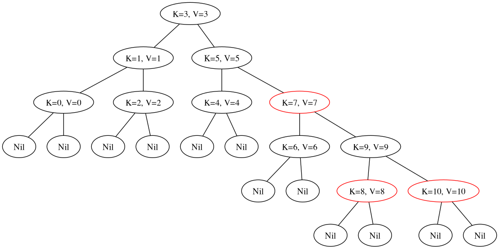
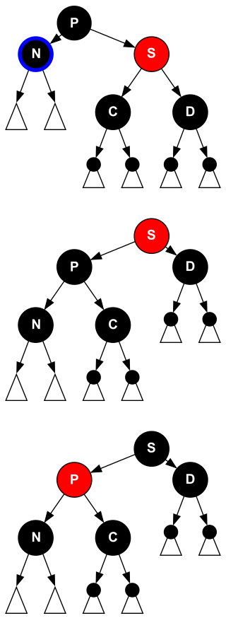
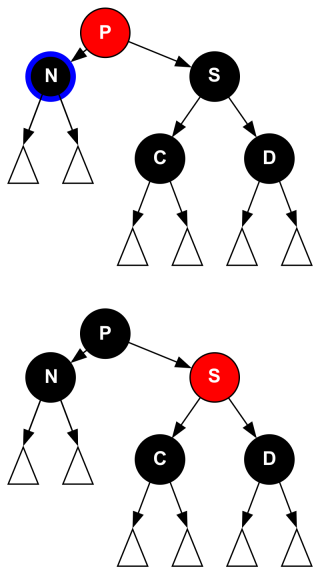
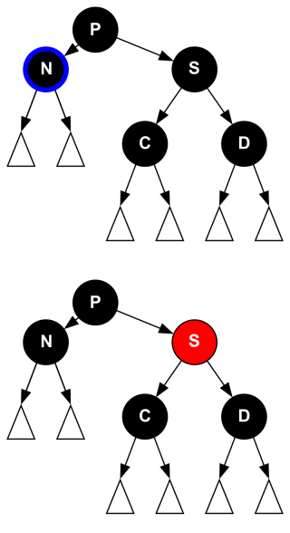
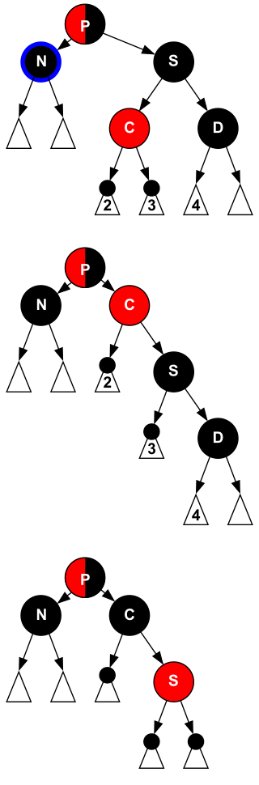
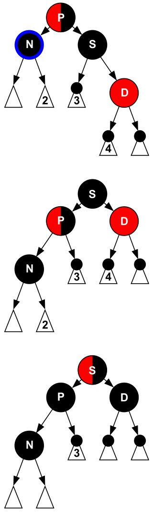

## 性质

1. 节点是红色或者黑色
2. 所有叶子都是黑色的（叶子节点是 Nil）
3. 不存在两个相邻的节点都为红色 （红色节点的子节点和父节点都是黑色的）
4. 从根节点到任何叶子节点的路径上的黑色节点数量都是相等的 （每条路径上的红色节点是少于黑色节点的，保证了最长路径不会超过最短路径的两倍）
5. 根是黑色

## 插入

插入的节点最初是红色, 插入的步骤：

- 根据二叉搜索树的规则，把节点插入到对应的位置
- 插入节点后，开始调整树

### Case 1

插入节点为第一个节点，这个节点在插入后为跟节点，将这个节点染为黑色。

### Case 2

插入节点后的父节点为黑色, 此时不做修改仍然满足红黑树的性质。（新节点为红色，新插入的节点的孩子是叶子节点，它的相邻的节点都不是红色，红色节点不会影响性质 4）

（注：二叉搜索树新插入的节点是叶子节点）


### Case 3

插入节点后的父节点为红色, 叔父节点也为红色, 把它们变为黑色，同时将祖父节点变为红色，如果祖父节点是根节点，不满足性质 5，如果
祖父节点不是根节点，可能不满足性质 3, 这时将祖父节点作为先插入的一个节点重新去考虑。


### Case 4

插入节点 N 后，节点 N 与 父节点 P 的方向相同 （例如：N 节点是 左孩子，P 节点是左孩子），而且节点 N 的叔父节点为黑色或者是一个 Nil 节点。在没有插入节点 N 时，树一定是满足所有性质的，我们可以旋转在染色的方法来使树合法。

- 如果 N 为左子节点则右旋转祖父节点 G，否则左旋转祖父节点 G，P - N 这条路径会少一个黑色节点。
- 将节点 N 染为黑色，节点 G 染为红色，此时每条路径的黑色节点与插入节点 N 前一样。


### Case 5

插入节点 N 后，节点 N 与 父节点 P 的方向不同 （例如：N 节点是 左孩子，P 节点是右孩子），而且节点 N 的叔父节点为黑色或者是一个 Nil 节点，这种情况可以通过对节点 P 左旋转来将其转化为 Case 4 的情况。


## 删除

### 删除红色节点

#### 红色叶子节点

红色节点可以直接删除，删除红色节点不会影响每条路径上黑色节点的数量，红色节点的父节点和子节点都是黑色的，因此删除红色节点后不存在两个红色节点是相邻的。

#### 只有一个子节点

同样可以直接删除。[同上（红色叶子节点的情况）](####红色叶子节点)

#### 有两个子节点

找到要被删除节点的前驱节点和后继节点，如果这两个节点有红色节点，将被删除的节点可以与这个红色节点换一下位置，这时就变成了 只有一个叶子节点 or 叶子节点的情况 (平衡树中前驱和后继节点不可能存在两个子节点), 直接删除就行。

两个都是黑色节点，仍然是与其中一个节点替换位置，这时就变成了要删除的节点是黑色节点。


### 删除黑色节点

黑色的叶子节点和只有一个子节点的黑色节点，被删除后需要进行调整才能保持性质。

有两个子节点的黑色节点可以找前驱或后继节点来替换，如果两个之中有红色节点，替换为红色节点，这时要删除的就是红色节点了，直接删出就行，否则，交换之后进行调整。

#### Case 1

兄弟节点 S 为红色，父节点 P 和侄子节点 C 、D 为黑色 （这种情况下 C、D 必为黑色）。

删掉 N 会导致有这条路径上少一个黑色节点，但是可以通过旋转从 S 上得到一颗子树这时 S 代替了原来 P 的位置，C 路径上会多一个黑色节点，D 路径上会少一个黑色节点，不过，会发现通过简单的染色就可已将其改为合法的。



#### Case 2

兄弟节点 S 和侄节点C、D均为黑色，父节点 P 为红色（N 是存在子树的，局部看虽然未删除前就不合法，但是完整的树可以是合法的）

这种情况和 Case 1 在旋转完后一摸一样，也是简单的染色就行，N 的子节点会成为 P 的子节点 (如果这是开始调整的初始状态，N 只会有一个节点，否则，会有两个节点，这时先把它交换到前驱或者后继，这样就不是 Case 2 了)



#### Case 3

兄弟节点 S，父节点以及侄节点C、D 都是黑色。这时就没办法只在局部调整从而使得整颗树合法了。

先将 S 染色，使得局部满足性质，接着递归 P 节点进行后续维护（将 P 作为要删除的节点）。



#### Case 4

兄弟节点是黑色，且与 N 同向的侄节点 C (close nephew) 为红色，与 N 反向的侄节点（distant nephew）为黑色,，父节点可以是红色也可以是黑色。

这种情况，旋转旋转将其转换为 Case 5 的初始状态。

- 旋转兄弟节点 S，N 为左节点右旋，否则左旋，将 close nephew(节点C) 变为节点 N 的兄弟节点。

- 交换 C 和 S 的颜色，变为了 Case 5 的初始状态



#### Case 5

兄弟节点是黑色，父节点可以是黑色也可以是红色，与 N 相反的节点为红色。

- 旋转 P，N 为左子节点，左旋，否则右旋。

- 交换 P 和 S 的颜色, 满足性质 4，(可能使 S 和 D 都为红色)。

- 将节点 D 染为黑色，此时满足所有性质。



## 性能和调试

```bash
cpu : 12th Gen Intel i7-12650H (16) @ 2.687GHz
gcc : 13.2.1
```

**性能与 `std::map` 还有很大 3 ~ 4 倍的差距，插入的性能会更差些。**

```cpp
constexpr int N = 1e6;
#define CLAC_TIME(start)                                                       \
  std::chrono::duration_cast<std::chrono::milliseconds>(                       \
      std::chrono::steady_clock::now() - start)                                \
      .count()

auto test_map() -> void {
  std::map<int, int> map;
  auto start = std::chrono::steady_clock::now();
  for (int i = 0; i <= N; ++i) {
    map.insert({i, i});
  }
  std::cout << std::format("map insert : {} ms\n", CLAC_TIME(start));
  start = std::chrono::steady_clock::now();
  for (int i = 0; i <= N; ++i) {
    if (i & 1) {
      assert(map[i] == i);
    } else {
      map.erase(i);
    }
  }
  std::cout << std::format("map remove : {} ms\n", CLAC_TIME(start));
}

auto test_rbt() -> void {
  rbt::Rbtree<int, int> rbt;
  auto start = std::chrono::steady_clock::now();
  for (int i = 0; i <= N; ++i) {
    rbt.insert(i, i);
  }
  std::cout << std::format("rbt insert : {} ms\n", CLAC_TIME(start));
  start = std::chrono::steady_clock::now();
  for (int i = 0; i <= N; ++i) {
    if (i & 1) {
      assert(rbt[i] == i);
    } else {
      rbt.remove(i);
    }
  }
  std::cout << std::format("rbt remove : {} ms\n", CLAC_TIME(start));
}
```

`debug` 模式下的性能


`release` 模式下的性能


`debug` 模式下的插入甚至是 `std::map` 的 5 倍， 删除也有 3 倍多, 但是 `release` 模式下只会相差 2 倍。


使用 dot 绘图，可以更清晰的观察小样例

```cpp
rbt.draw("test.dot");

```

```bash
dot -Tpng -o test.png test.dot
```


查看 test.png 即可

## 完整实现

代码太长了。。。

- [github/mingzi47/CppDemo/RedBlackTree](https://github.com/mingzi47/CppDemo/tree/main/RedBlackTree)

## 其他

- [红黑树 - 维基百科](https://zh.wikipedia.org/wiki/%E7%BA%A2%E9%BB%91%E6%A0%91)

- [红黑树 - OI Wiki](https://oi-wiki.org/ds/rbtree/)

- [红黑树演示](https://www.cs.usfca.edu/~galles/visualization/RedBlack.html)
